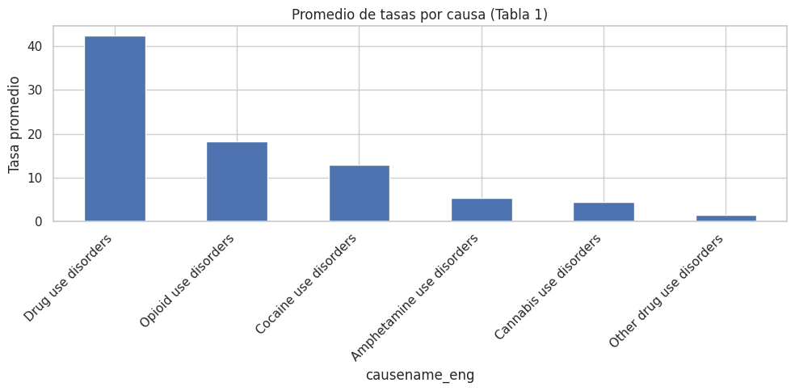
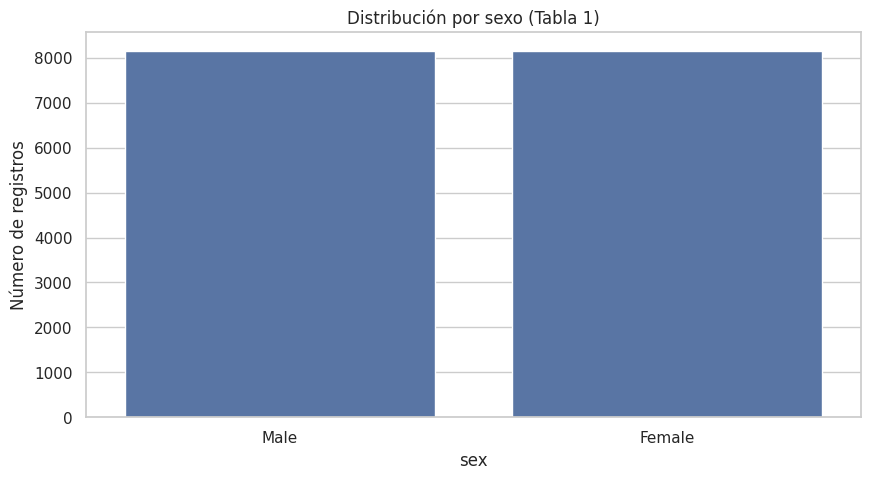
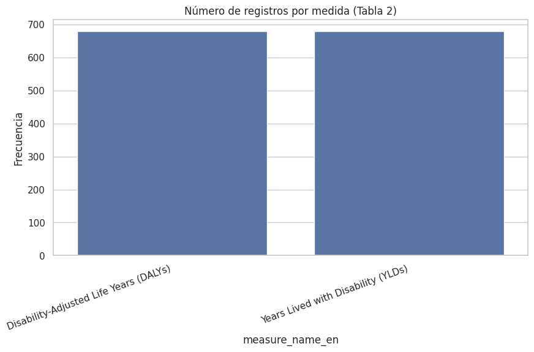
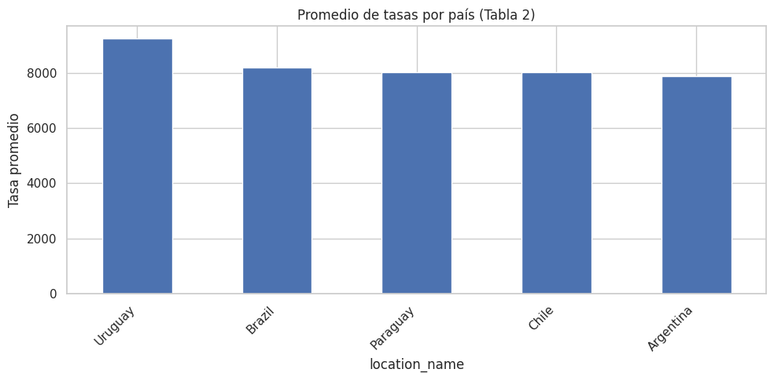
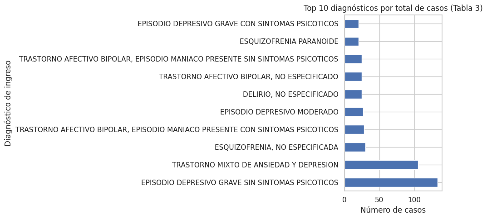
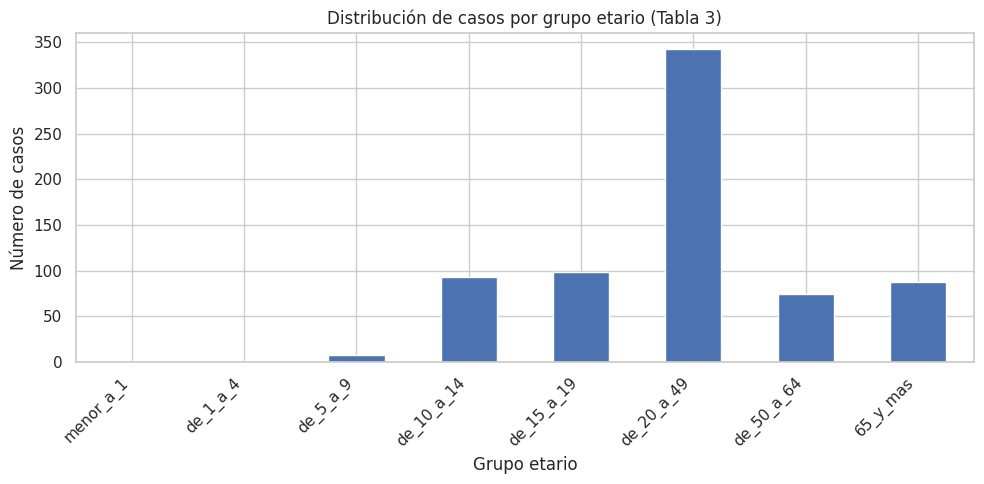

# Proyecto GYAD – Gestión y Almacenamiento de Datos
### Contexto 📌

Actualmente la salud mental se ha convertido en un tema que cada vez adquiere más relevancia a nivel global debido a factores como, la inestabilidad económica, la violencia social, el estés laboral y los efectos que tuvo a nivel psicológico la pandemia del COVID-19 ciertamente contribuyen a que esta problemática haya ido en aumento y sea cada vez más evidente la prevalencia y desarrollo de trastornos mentales como la depresión, la ansiedad y lo más alarmante, el riesgo de suicidio.

De acuerdo con datos obtenidos por la Organización Mundial de la Salud (OMS) y el Ministerio de Salud y Protección Social de Colombia, la reducción en la calidad de vida de las personas tiene como una de sus principales causas los problemas de salud mental. Este es un problema que no discrimina entre estrato social, edad, o género, ciertamente atañe tanto a jóvenes como a adultos.

Los sistemas de salud enfrentan salud enfrentan un problema muy notorio en cuanto a la cobertura de servicios especializados como lo son los servicios de psiquiatras, psicólogos clínicos, terapeutas ocupacionales y de familia, centros de atención en crisis, etc. Esto causa que la detección temprana de los casos sea ya en etapas más tardías cuando los síntomas del paciente se han agravado y son mucho más evidentes.

### Fuentes de datos 📂
- https://www.paho.org/en/enlace/burden-neurological-conditions
- https://www.paho.org/en/enlace/burden-drug-use-disorders
- https://www.paho.org/en/enlace/burden-mental-disorders

### Instalación y configuración ⚙️
##### Instalar XAMPP
- Descargar e instalar desde: https://www.apachefriends.org
- Asegurarse de activar los módulos Apache y MySQL.

##### Configurar la base de datos
- Acceder a phpMyAdmin en http://localhost/phpmyadmin.
- Crear una nueva base de datos.
- Importar los scripts SQL del proyecto (ubicados en la carpeta /database).

##### Clonar el repositorio
- https://github.com/MARIAFER0596/Proyecto-Gesti-n-y-Almacenamiento-de-Datos-equipo-4.git

##  Resultados preliminares 📊
#### Tabla 1 – Datos de consumo de drogas y desórdenes asociados
- Dimensiones: 16.320 registros, 12 columnas.
- Cobertura temporal: años 2020 y 2021.
- Variables principales: país, sexo, grupo de edad, causa, tipo de medida (muertes, DALYs, YLDs), valores con intervalos de confianza.
- Distribución por sexo: balanceado (8.160 hombres, 8.160 mujeres).
- Principales causas: desórdenes por uso de anfetaminas, cannabis, cocaína, opioides y drogas en general.
- Valores promedio: la tasa más alta corresponde a Drug use disorders (≈ 42), seguida de Opioid use disorders (≈ 18).

#### Gráficas:

#### Tabla 2 – Años de vida perdidos y vividos con discapacidad
- Dimensiones: 1.360 registros, 11 columnas (2020–2021).
- Medidas: DALYs y YLDs.
- Promedios por país: Uruguay presenta la tasa promedio más alta, seguido de Brasil, Paraguay, Chile y Argentina.

#### Gráficas:

#### Diagnósticos hospitalarios en Colombia
- Dimensiones: 142 registros, 12 columnas (2022–2023).
- Diagnósticos más comunes:
	- Trastornos por uso de múltiples drogas.
	- Episodio depresivo grave sin síntomas psicóticos.
	- Trastorno mixto de ansiedad y depresión.
	- Trastorno afectivo bipolar no especificado.
	- Esquizofrenia no especificada.

#### Gráficas:

#### Autores 👨‍💻 
- Andrés Felipe Quintero Sánchez
- Yusef Gabriel Aqil Tezna
- Juan Camilo Rivas Velasco
- Miguel Angel Jimenez Trochez
- Maria Fernanda Bolaños Tosse

¡Gracias por explorar este proyecto! 🚀
